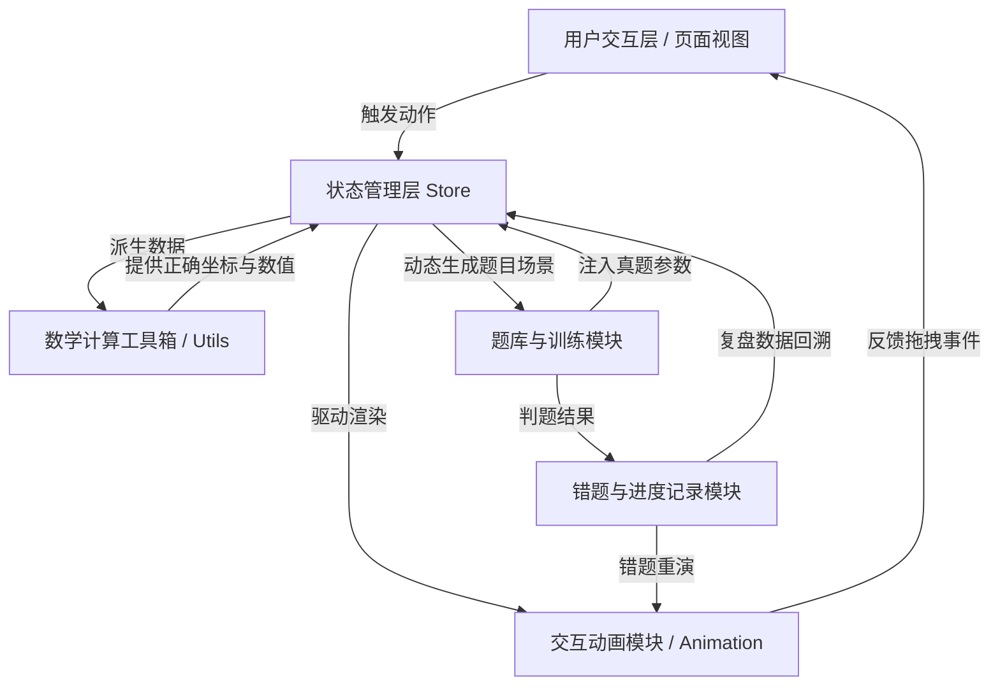

# MathVision 项目架构设计 (V1.1_Antigravity版)

## 1. 目录结构

```text
/
├── .agents/                 # AI Agent 规范与约束
│   ├── rules/               # 硬性约束规则 (math_rules.md, ui_rules.md)
│   └── workflows/           # 标准化工作流 (new_knowledge_experiment.md, add_real_question.md)
├── skills/                  # 各个专用 Agent 的技能定义
│   ├── math/                # 数学内容 Agent
│   ├── animation/           # 交互动画 Agent
│   ├── ui/                  # UI 设计 Agent
│   ├── state/               # 状态管理 Agent
│   └── question_bank/       # 题库系统 Agent
├── src/
│   ├── components/          # 可复用组件层
│   │   ├── common/          # 通用 UI 组件 (Button, Slider, Card)
│   │   ├── math/            # 数学渲染组件 (Formula, CoordinateSystem)
│   │   └── animations/      # 可复用动画组件 (VectorArrow, AngleArc)
│   ├── features/            # 核心业务模块
│   │   ├── trigonometry/    # 三角函数模块 (单位圆, 图像, 恒等变换)
│   │   ├── vectors/         # 平面向量模块 (向量运算, 点积, 奔驰定理)
│   │   └── exam_training/   # 高考真题训练模块
│   ├── store/               # 全局状态管理层 (Zustand)
│   │   ├── useMathState.js  # 核心数学对象联动状态
│   │   ├── useUIState.js    # 交互模式与界面状态
│   │   └── useRecordStore.js# 错题与进度状态
│   ├── data/                # 静态数据与题库
│   │   ├── questions/       # 真题 JSON 题库
│   │   └── rules/           # 本地化规则树
│   ├── pages/               # 页面级视图
│   └── utils/               # 工具函数 (向量运算, 几何坐标变换等)
└── public/                  # 静态资源
```

## 2. 状态数据流模型 (State Data Flow)

本项目采用单向数据流与响应式状态管理（如 Zustand），确保“单位圆—向量—图像”三屏联动时的数学对象高度一致。

### 2.1 核心状态 Store (`useMathState`)
针对向量与三角函数的联动，定义如下核心状态模型：

```javascript
// 状态模型伪代码
const useMathState = create((set, get) => ({
  // 1. 基础几何实体 (Independent Variables)
  baseAngle: 0, // 当前参考角
  baseVector: { x: 1, y: 0 }, // 基础向量
  
  // 2. 派生状态 (Derived Variables - 实时联动)
  // 通过 getter 或衍生逻辑自动计算，保持一致性
  get unitCirclePoint() {
    return {
      x: Math.cos(get().baseAngle),
      y: Math.sin(get().baseAngle)
    }
  },
  
  get currentTrigValues() {
    return {
      sin: Math.sin(get().baseAngle),
      cos: Math.cos(get().baseAngle),
      tan: Math.tan(get().baseAngle)
    }
  },
  
  // 3. 动作分发 (Actions)
  setBaseAngle: (angle) => set({ baseAngle: angle }),
  updateVector: (vec) => set({ baseVector: vec }),
}))
```

### 2.2 状态联动闭环
- **用户交互**（拖动单位圆上的点 / 拉动滑块 / 拖拽向量）。
- **更新基础状态**（Dispatch `setBaseAngle` 或 `updateVector`）。
- **衍生数据自动重算**（触发 `unitCirclePoint`, `currentTrigValues` 等依赖数据的重新计算）。
- **多视图同步渲染**（单位圆视图、函数图像视图、点积投影视图同时响应数据变化，实现“视觉一致性”）。

## 3. 模块间依赖关系图

模块间通过数据和事件总线解耦，确保逻辑清晰。



### 3.1 模块依赖规则
1. **动画层只负责视觉呈现**：Animation 模块不存储数学真实状态，其几何属性（位置、角度、长度）完全由 Store 中的真实数据驱动。
2. **题库层决定上下文**：在真题训练模式下，QuestionBank 会锁定或初始化 Store 的基础变量，建立特定的约束条件（如解三角形中的已知两边一夹角）。
3. **记录层被动收集**：错题与学习进度被动监听 Store 的变化和题库的判题事件，不对核心交互产生直接副作用。
