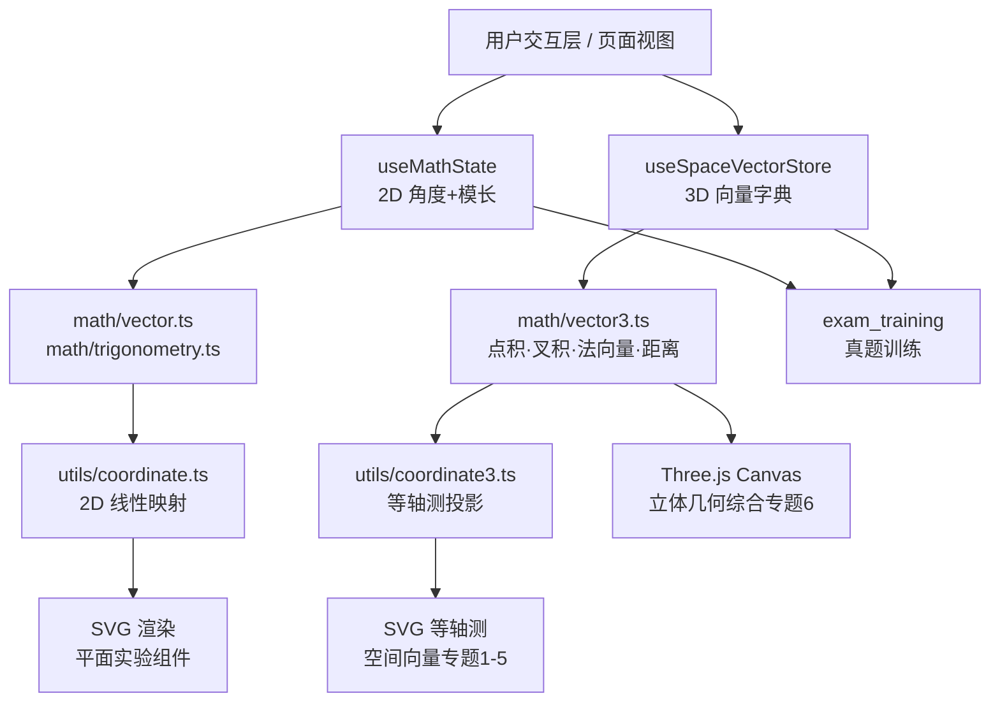

# MathVision 项目架构设计 (V1.2_里程碑4扩展版)

> 最后更新：2026-05-25 | 基于里程碑 4 架构适配性评估，新增空间向量层设计

## 1. 目录结构

```text
/
├── .agents/                 # AI Agent 规范与约束
│   ├── rules/               # 硬性约束规则 (math_rules.md, ui_rules.md)
│   └── workflows/           # 标准化工作流 (new_knowledge_experiment.md, add_real_question.md)
├── skills/                  # 各个专用 Agent 的技能定义
│   ├── math/                # 数学内容 Agent
│   ├── animation/           # 交互动画 Agent
│   ├── ui/                  # UI 设计 Agent
│   ├── state/               # 状态管理 Agent
│   └── question_bank/       # 题库系统 Agent
├── src/
│   ├── components/          # 可复用组件层
│   │   ├── common/          # 通用 UI 组件（ThreeScreenLayout 等）
│   │   ├── math/            # 数学渲染组件 (Formula, CoordinateSystem)
│   │   └── animations/      # 可复用动画组件 (VectorArrow, AngleArc)
│   ├── features/            # 核心业务模块
│   │   ├── unit-circle/     # 单位圆与诱导公式模块
│   │   ├── vector/          # 平面向量模块（加法、点积、奔驰定理）
│   │   ├── function-graph/  # 三角函数图像与解三角形模块
│   │   ├── trig-identity/   # 三角恒等变换模块
│   │   ├── exam_training/   # 高考真题训练模块
│   │   └── space-vector/    # 【里程碑4新增】空间向量与立体几何模块
│   │       ├── SpaceVectorBasic.tsx    # 专题1：基础概念与线性运算
│   │       ├── SpaceVectorCoord.tsx    # 专题2：坐标表示与运算
│   │       ├── SpaceVectorTheorem.tsx  # 专题3：基本定理与性质
│   │       ├── SolidGeoJudge.tsx       # 专题4：几何判定
│   │       ├── SolidGeoMetric.tsx      # 专题5：空间角与距离
│   │       └── SolidGeo3D.tsx          # 专题6：Three.js 综合（阶段3）
│   ├── store/               # 全局状态管理层 (Zustand)
│   │   ├── useMathState.ts          # 2D 核心数学状态（angleRad + radius）
│   │   ├── useExamStore.ts          # 答题会话与错题记录
│   │   └── useSpaceVectorStore.ts   # 【里程碑4新增】3D 空间向量场景状态
│   ├── math/                # 数学纯函数库（⚠️ 严禁引入副作用）
│   │   ├── vector.ts        # 2D 向量运算（现有）
│   │   ├── trigonometry.ts  # 三角函数计算（现有）
│   │   ├── trigIdentity.ts  # 三角恒等变换（现有）
│   │   └── vector3.ts       # 【里程碑4新增】3D 向量运算
│   ├── types/               # TypeScript 类型定义
│   │   ├── math.ts          # 2D 数学类型（Vector2、MathStore 等，现有）
│   │   ├── exam.ts          # 题目与答题类型（现有）
│   │   └── vector3.ts       # 【里程碑4新增】Vector3 与空间场景状态类型
│   └── utils/               # 工具函数
│       ├── coordinate.ts    # 2D 坐标转换：数学坐标 ↔ 屏幕像素（现有）
│       └── coordinate3.ts   # 【里程碑4新增】3D 等轴测投影：Vector3 → Vector2
└── public/                  # 静态资源
```

---

## 2. 状态数据流模型 (State Data Flow)

本项目采用单向数据流与响应式状态管理（Zustand），确保"单位圆—向量—图像"三屏联动时的数学对象高度一致。

### 2.1 核心状态 Store：`useMathState`（2D）
针对平面向量与三角函数的联动，基础状态为 `angleRad + radius + graphParams`。

```typescript
// 真值基底（⚠️ 派生量 sin/cos/tan/(x,y) 严禁写入 Store）
interface MathBaseState {
  angleRad: number;    // 当前角度，弧度制，规范化区间 [0, 2π)
  angleRad2: number;   // 第二角度（双角实验用）
  radius: number;      // 向量模长
  graphParams: TrigGraphState;  // y=Asin(ωx+φ)+b 参数
  isAnimating: boolean;
  isAngleLocked: boolean;
}
```

### 2.2 空间向量 Store：`useSpaceVectorStore`（3D）【里程碑4新增】
与 `useMathState` 完全独立，两者严禁互相引用。

```typescript
// 真值基底（派生量如夹角、法向量严禁写入 Store）
interface SpaceVectorState {
  vectors: Record<string, Vector3>;   // 命名向量字典（"a", "b", "n" 等）
  selectedId: string | null;           // 当前选中向量 ID
}
// Actions
setVector(id: string, v: Vector3): void;
removeVector(id: string): void;
clearAll(): void;
select(id: string | null): void;
```

### 2.3 状态联动闭环
```
用户交互（拖拽顶点 / 输入坐标）
  → setVector Action → 修改 SpaceVectorStore
    → 组件通过 selector 订阅
      → useMemo 派生法向量/距离等
        → 等轴测 SVG 重渲染 + 演算看板联动
```

---

## 3. 渲染引擎分层策略（里程碑4关键决策）

```
┌────────────────────────────────────────────┐
│  渲染层  │  技术栈       │  适用场景        │
├──────────┼───────────────┼──────────────────┤
│  2D SVG  │  React SVG    │  里程碑 1-3 全部  │
│          │  + mathToScreen│  平面向量/单位圆  │
├──────────┼───────────────┼──────────────────┤
│ 3D SVG   │  React SVG    │  里程碑4 专题1-5  │
│ 等轴测   │  + isoProject │  概念理解/判定/度量│
│          │  (coordinate3) │  无需新依赖       │
├──────────┼───────────────┼──────────────────┤
│ 3D WebGL │  Three.js +   │  里程碑4 专题6    │
│          │  @r3f/fiber   │  旋转/截面/综合题  │
│          │  @r3f/drei    │  独立 Canvas 层   │
└────────────────────────────────────────────┘
```

**等轴测投影公式**（`coordinate3.ts` 核心逻辑）：
```typescript
// 将三维数学坐标投影为二维 SVG 屏幕坐标
function isoProject(v: Vector3, unitPx: number): Vector2 {
  const cos30 = Math.sqrt(3) / 2;
  const sin30 = 0.5;
  return {
    x: (v.x - v.z) * cos30 * unitPx,
    y: (v.x + v.z) * sin30 * unitPx - v.y * unitPx,
  };
}
```

---

## 4. 模块间依赖关系图



---

## 5. 架构约束规则汇总

### 5.1 向量优先律（2D）
1. **真值唯一性**：`angleRad + radius` 是唯一真值，存于 `useMathState`。
2. **派生量禁入 Store**：`sin/cos/tan/(x,y)` 只在组件内用 `useMemo` 派生。
3. **向量优先**：`cos/sin` 从向量分量读取（`angleToVector` 先行）。
4. **坐标隔离**：像素转换只在 `src/utils/coordinate.ts` 中发生。

### 5.2 空间向量扩展约束（3D，里程碑4新增）
5. **Store 独立**：`useMathState`（2D）与 `useSpaceVectorStore`（3D）严禁互相引用，零耦合。
6. **等轴测先行**：专题 1-5 优先用纯 SVG 等轴测投影，Three.js 仅用于专题 6，避免提前引入重型依赖。
7. **3D 派生量禁入 Store**：法向量、夹角、面法量等均为派生量，通过 `vector3.ts` 纯函数在组件 `useMemo` 中计算。
8. **Canvas 隔离**：Three.js `<Canvas>` 只在 `SolidGeo3D.tsx` 中存在，不污染任何现有 SVG 组件树。

### 5.3 通用约束
- **路径别名**：全部使用 `@/` 别名，严禁 `../` 相对路径。
- **奇异点处理**：`tan` 在 π/2+kπ 处返回 `null`，不用 `Infinity`。
- **纯函数严禁副作用**：`src/math/` 下所有文件严禁引入 React 状态、DOM、Canvas 像素坐标。

---

## 6. 模块依赖规则（更新版）

1. **渲染层只负责视觉呈现**：SVG/Canvas 组件不存储数学真实状态，所有几何属性完全由 Store 驱动。
2. **Store 与 Store 之间零耦合**：`useMathState` 与 `useSpaceVectorStore` 分别管理各自领域，不共享任何状态字段。
3. **纯函数库层是唯一计算核心**：所有数学计算集中在 `src/math/` 下，组件层只调用，不实现。
4. **坐标转换层是唯一的像素逻辑出口**：`coordinate.ts`（2D）和 `coordinate3.ts`（3D）是数学坐标与屏幕坐标之间的唯一桥梁。
5. **题库层决定上下文**：在真题训练模式下，题库会锁定或初始化 Store 的基础变量，建立特定约束（如已知两边一夹角）。
6. **记录层被动收集**：错题与学习进度被动监听 Store 的变化和题库的判题事件，不对核心交互产生副作用。
